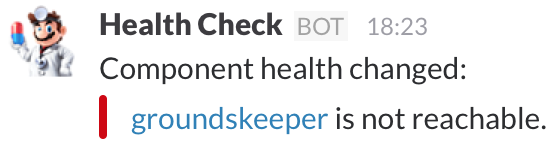

<h1 align="center">Health Check Adapter</h1>
<p align="center">Send health check changes to Slack</p>

[](https://imagelayers.io/?images=bripkens/health-check-adapter:latest 'Get your own badge on imagelayers.io')

This application connects to one or more applications and
continuously calls the applications' health check endpoint to determine
the applications' health. When the health status changes, it will send
a message to a Slack channel.

<p align="center">
  
</p>

*We are living in a weird world: This tool is not affiliated with Dr. Mario in any way and copyright belongs to Nintendo. You probably knew that, but you know how it is…*

## How It Works
The mechanism is currently very simple:

 - An actor is started for every configured component. These actors will
   continuously poll the components' health check endpoints in the
   configured interval.
 - A component is determined to be…
   - *healthy* when the health check endpoint returns a `200` HTTP status code,
   - *not reachable* when a connection cannot be established or the health
     check does not send a response within two seconds or
   - *unhealthy* in all other cases. 
 - When an identified component's health changes, a message is send to
   its designated reporting actor. Reporting actors are named and it is
   possible to use varying reporting strategies per component.
 - The reporting actor compares the component health to the previous health
   and executes its reporting action, e.g. sends a message to Slack or
   prints to the console.

## Usage
There are currently two known usage patterns. The first and recommended one is
via a Docker container. The other one is the compilation from source.

### Docker Container
The Docker image is
[published to Docker Hub](https://hub.docker.com/r/bripkens/health-check-adapter/).
This makes it comfortable if you already have Docker configured. Care was taken
to follow Docker best practices and to a have a proper init process. Image usage
is easy and the only additional thing you will need is a configuration file for
the health checks.

The health check adapter expects a config file to exist at
`/opt/health-check-adapter/config/config.yaml` within the container. To place
a config file at this location you can either create a derived image which
copies a config to this location or you can make use of volumes. The following
example shows how you can run the health check adapter in a Docker container
using volumes.

```
docker run -v "`pwd`:/opt/health-check-adapter/config" \
       --name health-check-adapter \
       bripkens/health-check-adapter
```

The command will start a Docker container and mount the current working
directory at `/opt/health-check-adapter/config` within the container. This
means that we can place a `config.yaml` into the current working directory
in order to configure the health check adapter.

Application logging is enabled and logs are stored at
`/var/log/health-check-adapter.log`. 

### Manual Setup
There is no distribution of the compiled application besides the Docker image.
This means that you will need to compile it from source in all other cases
To get this up and running manually…

 - clone this repository,
 - build the project, e.g. `sbt assembly` and
 - execute it with the main class `de.bripkens.ha.App` and the path to the
   config file as its only argument.

## Configuration
In order to make use of the health check adapter, you will need to configure
the components and reporters. The configuration is done in YAML format. The
following example shows a simple configuration. For further reference,
inspect the [class definitions](https://github.com/bripkens/health-check-adapter/blob/master/src/main/scala/de/bripkens/ha/Configuration.scala)
into which the configuration will be deserialized.

```yaml
---
endpoints:
  - url: http://127.0.0.1:8081/healthcheck
    id: shopping
    name: Shopping System
    # How often the health of the component should be checked in millis
    interval: 3000
    reporter: mySlackReporter
  - url: http://127.0.0.1:8181/healthcheck
    id: recommendation
    name: Recommendation system
    interval: 10000
    reporter: myConsoleReporter

reporters:
  mySlackReporter:
    type: slack
    # either use a channel (identified via leading #) or
    # send a direct message to a user (identified via leading @)
    channel: #test
    # see the Slack WebHook API reference to generate this url:
    # https://api.slack.com/incoming-webhooks
    webhookUrl: https://hooks.slack.com/services/<some secret id>
    botName: Health Check
    botImage: http://lorempixel.com/64/64/
  myConsoleReporter:
    type: console
```

## FAQ

- **We are not using Slack, can we use this adapter with X?**: This health
  check adapter has a concept of reporters. Currently only a Slack and console
  reporter exist. Feel free to open a pull request to add another reporting
  integration!

## Contributing

### Working on the Docker image
To work on the image, you can execute the `./deployment/build` script. It
will build the project and the Docker image. You can even try the Docker
image locally via:

```
docker run -v "`pwd`/src/test/resources:/opt/health-check-adapter/config" \
       --name health-check-adapter \
       bripkens/health-check-adapter
```

### Releasing a new Docker image
Make sure that you are signed in to Docker Hub via `docker login` and then
execute the `./deployment/build --release` script. The script will build the
project, build the new Docker image and push it to Docker Hub. The script
will only push to Docker Hub when the `--release` parameter is specified.
This is useful for local development purposes.

## License (MIT)
The MIT License (MIT)

Copyright (c) 2015 Ben Ripkens

Permission is hereby granted, free of charge, to any person obtaining a copy
of this software and associated documentation files (the "Software"), to deal
in the Software without restriction, including without limitation the rights
to use, copy, modify, merge, publish, distribute, sublicense, and/or sell
copies of the Software, and to permit persons to whom the Software is
furnished to do so, subject to the following conditions:

The above copyright notice and this permission notice shall be included in all
copies or substantial portions of the Software.

THE SOFTWARE IS PROVIDED "AS IS", WITHOUT WARRANTY OF ANY KIND, EXPRESS OR
IMPLIED, INCLUDING BUT NOT LIMITED TO THE WARRANTIES OF MERCHANTABILITY,
FITNESS FOR A PARTICULAR PURPOSE AND NONINFRINGEMENT. IN NO EVENT SHALL THE
AUTHORS OR COPYRIGHT HOLDERS BE LIABLE FOR ANY CLAIM, DAMAGES OR OTHER
LIABILITY, WHETHER IN AN ACTION OF CONTRACT, TORT OR OTHERWISE, ARISING FROM,
OUT OF OR IN CONNECTION WITH THE SOFTWARE OR THE USE OR OTHER DEALINGS IN THE
SOFTWARE.

